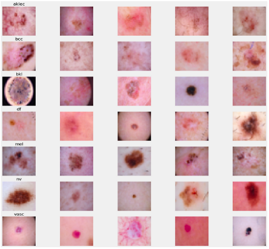
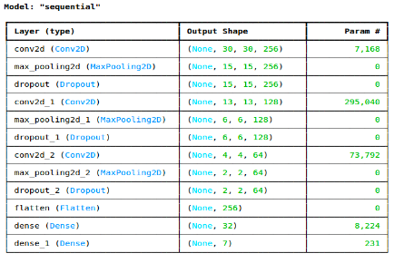
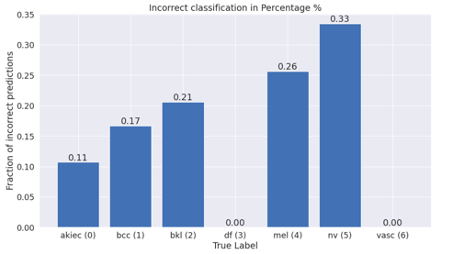
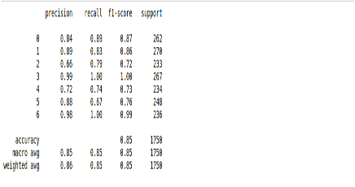

# Convolutional Neural Network (CNN ) Based Approach for Multiclass Classification of skin lesions from HAM10000 dermatoscopic image

## Key Points
1. **Big Data Storage and Processing**, Deep Learning CNN used to completed this project
2. **Hadoop Distributed File System** is used to store the data and **Python API of Spark called PySpark** is used for Processing Data
3. **Keras** is used In Deep Learing

# Approach for the project

1. Data Ingestion :
    * In Data Ingestion phase the data is first stored on Hadoop and read using PySpark as csv.
    * Then the data is split into training and testing and saved as csv file.

2. Data Transformation :
    * to scale image data after converting into 32*32 pixel of NumPy Arry divided by 255. Beacuse pixel scale from 1-255.
    * for Categorical Variables SimpleImputer is applied with most frequent strategy, then OneHotEncoder performed , after this data is scaled with Standard Scaler.

3. Model Creation :
    * In this phase base model is created .
    * **relu** is used as activation function **Adam** is used as Optimizer .
    * **Categorical Cross-Entropy** is used because dependent variable is Multiclass.
    
4. Testing
   * Model accuracy is **84%** over **150 epochs with bactch_size= 128** with some overfitting which can be fixed by reducing epochs

# Screenshot of Findings

#### Images of Skin Lesion Based on Multiclass

#### Deep Learning Modal

#### Ratio of Incorrect Classification by Deep Learning Modal

#### Classification Metrics

